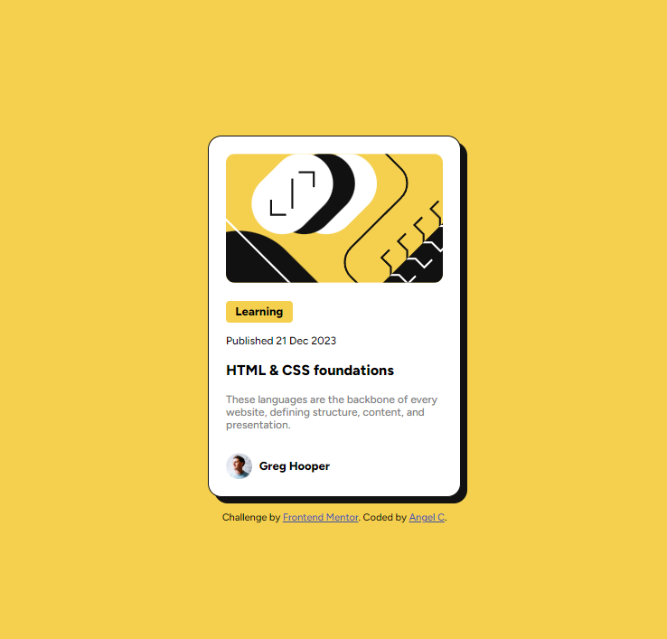

# Frontend Mentor - Blog preview card solution

This is a solution to the [Blog preview card challenge on Frontend Mentor](https://www.frontendmentor.io/challenges/blog-preview-card-ckPaj01IcS). Frontend Mentor challenges help you improve your coding skills by building realistic projects.

## Table of contents

- [Overview](#overview)
  - [Screenshot](#screenshot)
  - [Links](#links)
- [My process](#my-process)
  - [Built with](#built-with)
  - [What I learned](#what-i-learned)
  - [Continued development](#continued-development)
- [Author](#author)

## Overview

### Screenshot

### Links

- Live Site URL: [Add live site URL here](https://angelcoronait.github.io/FM-BlogPreviewCard/)

## My process

### Built with

- Semantic HTML5 markup
- CSS custom properties
- Flexbox

### What I learned

I fix problems i had in the last challenge, now i added the roles,import correctly the font.

### Continued development

I would get familiar with flexbox, grid and get comfortable with css properties like box-shadow

## Author

- Frontend Mentor - [@AngelCoronaIT](https://www.frontendmentor.io/profile/AngelCoronaIT)
